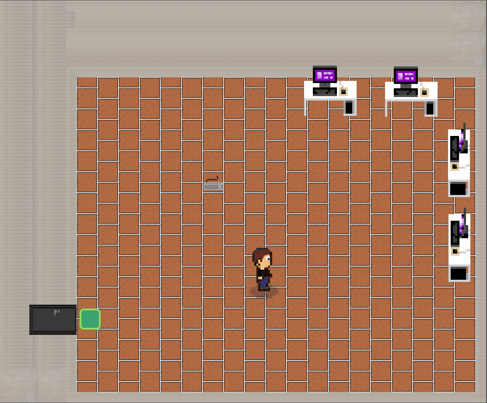

# Statický svět

Svět ve hře byl inspirován realnými prostory budovy ČVUT FA/FIT, zejména přízemím. Nachází se zde např. vrátnice, kavárna, přednáškový sál a počítačová učebna. Forma a vizualizace je uzpůsobena času ve hře, tedy během probíhajícího dne otevřených dveří.

Příklady objektů v prostoru: 
- lavičky
- stoly
- automat na kávu
- výstavní bannery 

### Vrátnice
Příklady objektů:
- přepážka
- dveře na vstupní kartu
- reklamní poutače
- odpadkové koše

### Přízemí fakulty
Příklady objektů:
- lavičky
- automat na kávu

### Kavárna
Příklady objektů:
- pult 
- stoly a židle

### Přednáškový sál
Příklady objektů:
- sedačky
- tabule 
- přednáškový pult

### Počítačová učebna
Příklady objektů:
- stoly s počítači

## Dynamické objekty
Ve hře se lze potkat celkově devět postav, kde s pěti z nich je možno interagovat. Důležité pro příběh jsou zde postavy tři, tedy s nimi hráč musí interagovat za účelem dokončení hry. Vzhled byl vytvořen pro každou důležitou postavu unikátní, některé z nich jsou také navržené dle skutečných předloh. U kompazrových postav pro oživení světa se vzhledy mohou opakovat.

### Příklady návrhů postav

