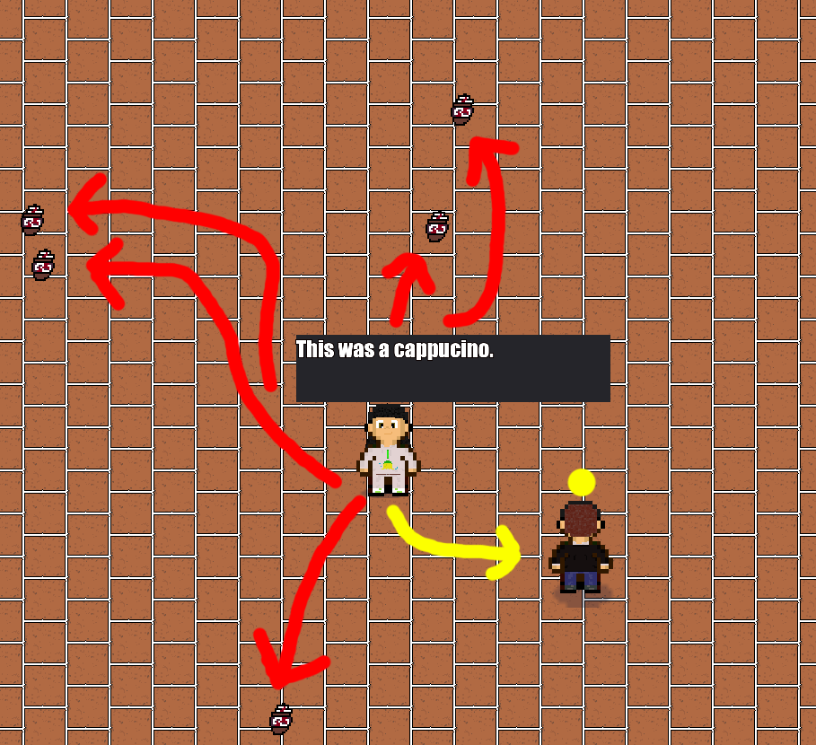
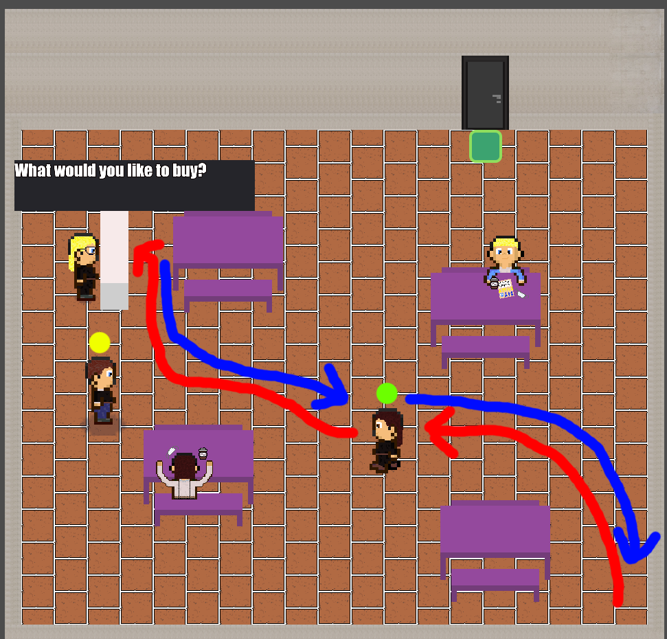

# Dynamický svět

Následující dokument popisuje přidání dynamiky do vytvořeného herního světa.

## Animace pohybu
Každá postava ve hře má přidělené animace, které jsou ve 2D top-down modelu hry příkladně zobrazené v následujícím pořadí:
  - chůze směrem natočení ke hráči
  - chůze vpravo
  - chůze vlevo
  - chůze směrem natočení ke hráči vzad
  - 
  
## Animace sezení
Dále mají postavy idle animace při sezení:
  - směrem zády k hráči
  - čelem ke hráči
  - levým/pravým bokem k hráči
  
### Příklady animací
  - 
  - 

## Cyklické činnosti
- **Uklízečka**
  - sbírá odpadky -> pokud ji někdo ruší, komunikuje s narušitelem -> sbírá odpadky
  - 
- **Zákazník v kavárně**
  - čeká na hráče, aby jej mohl předběhnout ve frontě -> jde k pultu, pokud je hráč v cestě, tak mu vynadá -> kupuje kávu u pultu -> jde se schovat do rohu, pokud je hráč v cestě, tak mu vynadá
  - 
  
## Produkce
- **Uklízečka**
  - nepořádní studenti ve škole házejí odpadky na podlahu -> tyto odpadky jsou sbírány uklízečkou, která je likviduje
- **Přednášející**
  - vždy, když se hráč slušně zeptá, může dostat kávu

## Chování
- **Uklízečka**
  - uklízí odpadky
  - mluví sama se sebou
  - zadá hráči úkol s odměnou 
- **Vrátná**
  - předá hráči vstupní kartu
  - davá hráči tipy co navštívit a kam se podívat
- **Baristka**
  - obsluhuje zákazníky u pultu v kavárně
  - odmítá obsloužit hráče, protože ten nemá žádné peníze
- **Zákazník**
  - nemá rád, když mu hráč překáží v cestě
  - částo si kupuje kávu od baristky
  - je stydlivý, chodí se schovávat do kouta
- **Přednášející**
  - přednáší
  - klade otázky
  - rozdává kávu
  - potřebuje pomoci s nalezením jeho klávesnice
  
## Unikáty
### Silně podmíněno
Následující události jsou podmíněny činností hráče:
- **Vstupní karta**
  - hráč musí promluvit s vrátnou, aby dostal vstupní kartu a mohl pokračovat do dalších prostor
- **Kliče do počítačové učebny**
  - hráč musí pomoci uklízečce tím, že sebere 10 prázdných kelímků, kde za odměnu dostane tyto klíče
- **Ztracená klávesnice**
  - s klíčemi lze odemknout počítačovou učebnu, kde se nachází klávesnice přednášjícího
  - tím, že předáme klávesnici zpět přednášejícímu dostaneme stipendium na fakultu a hra končí
  
