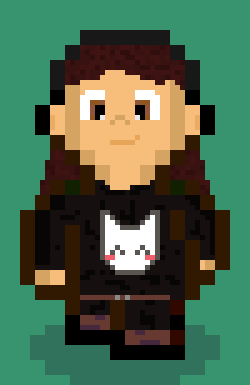
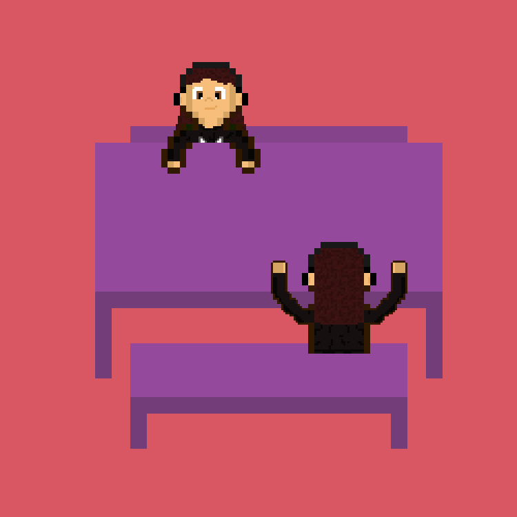

# Dynamický svět

Následující dokument popisuje přidání dynamiky do vytvořeného herního světa.

## Animace pohybu
Každá postava ve hře má přidělené animace, které jsou ve 2D top-down modelu hry příkladně zobrazené v následujícím pořadí:
  - chůze směrem natočení ke hráči
  - chůze vpravo
  - chůze vlevo
  - chůže směrem natočení ke hráči vzad
  - 
  
## Animace sezení
Dále mají postavy idle animace při sezení:
  - směrem zády k hráči
  - čelem ke hráči
  - levým/pravým bokem k hráči
  
### Příklady animací
  - 
  - 

## Cyklické činnosti
- **Uklízečka**
  - sbírá odpadky -> pokud ji někdo ruší, komunikuje s narušitelem -> sbírá odpadky
  - 
- **Zákazník v kavárně**
  - čeká na hráče, aby jej mohl předběhnout ve frontě -> jde k pultu, pokud je hráč v cestě, tak mu vynadá -> kupuje kávu u pultu -> jde se schovat do rohu, pokud je hráč v cestě, tak mu vynadá
  - 
  
